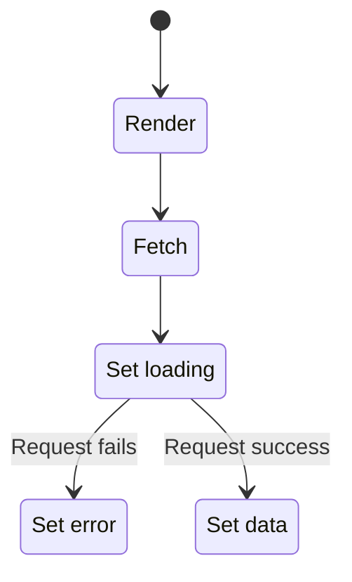

  
  <h1 style="margin-left: 1rem;">React Query 101</h1>

  <small>Async data management with hooks</small>

<footer style="font-size: 0.75em;">2021-04-07</footer>

<!--s-->

# Async Data Management

<!--v-->

Note: We want to start the data request on our component render, and we want
to keep track of the request status providing our user with feedback.

<!--v-->

# The vanilla hooks

<pre data-id="code-animation"><code class="hljs" data-trim data-line-numbers="|2-5|8|10-21|24-27"></code></pre>

Notes: Let's go step by step, first we need to define our state, we are using
the builtin useState hook for that, then we define the condition which enables
our request. Then we handle our request, setting the state as needed, in this
case it's a simple request, we don't care about retrying or handling the promise
resolving after our component was unmounted. And then we will handle the
rendering, providing the user with feedback of the request status and once it's
done we show the data.

<!--v-->

# Redux

<pre data-id="code-animation"><code class="hljs" data-trim data-line-numbers="|2-8|11|12|15-18"></code></pre>

Notes: We will also need to define our action creators, reducers and all the
Redux boilerplate as well.

<!--v-->

# React Query

<pre data-id="code-animation"><code class="hljs" data-trim data-line-numbers="|3-8|4|5|6|9-12"></code></pre>

<!--s-->

# What's in the box

<!--v-->

# Caching

<pre data-id="code-animation"><code class="hljs" data-trim data-line-numbers="|2"></code></pre>

Note: When we register a useQuery call we pass it's key, with this all components
that registered the same key will be updated as well, and it will only make one
call. Key works like a selector. Global state.

<!--v-->

# Retrying

<pre data-id="code-animation"><code class="hljs" data-trim data-line-numbers="|6-7"></code></pre>

<!--v-->

# Refreshing

<pre data-id="code-animation"><code class="hljs javascript" data-trim data-line-numbers="|8"></code></pre>

<!--v-->

# Mutations

<pre data-id="code-animation"><code class="hljs javascript" data-trim data-line-numbers="|5|7-8,16-17|11-14|22-24|19-21|27"></code></pre>

<!--s-->

# Demo

<!--s-->

<iframe src="https://codesandbox.io/embed/gifted-grass-bstuv?fontsize=14&hidenavigation=1&theme=light"
     style="width:100%; height:500px; border:0; border-radius: 4px; overflow:hidden;"
     title="gifted-grass-bstuv"
     allow="accelerometer; ambient-light-sensor; camera; encrypted-media; geolocation; gyroscope; hid; microphone; midi; payment; usb; vr; xr-spatial-tracking"
     sandbox="allow-forms allow-modals allow-popups allow-presentation allow-same-origin allow-scripts"
   ></iframe>

<!--s-->

# Thanks!

### [React Query docs](https://react-query.tanstack.com/)
### [Codesandbox example](https://codesandbox.io/s/busy-shape-9n9we?file=/src/index.js)
